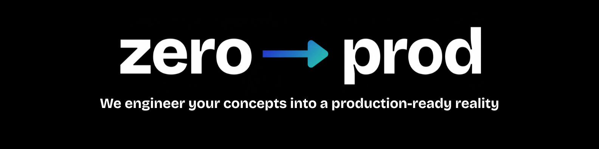

<p align="center">
  
</p>

<br />

<p align="center">
  <strong>We engineer your concepts into a production-ready reality.</strong>
</p>

<p align="center">
  <a href="https://www.zerotoprod.tech">Website</a> •
  <a href="https://www.linkedin.com/company/zero2prod/">LinkedIn</a> •
  <a href="https://x.com/zero_to_prod">X (Twitter)</a> •
  <a href="mailto:Hello@zerotoprod.tech">hello@zerotoprod.tech</a>
</p>

<br />

---

## What We Do

Zero → prod is an AI & product engineering studio that turns your ideas into production-ready systems — fast, clean, and built to scale.

We work with founders, startups, and businesses across industries to design, build, and deploy intelligent software that actually works in the real world. Whether you're looking to automate workflows, integrate AI into your existing stack, or build something entirely new from scratch — we take your concept from **zero** and ship it to **production**.

No fluff. No endless back-and-forth. Just engineering that moves at the speed your business demands.

From ideation to deployment — we own the full journey.

---

## What We Build

| Service | Description |
|---|---|
| 🤖 **AI Integration & ML** | Purpose-built AI systems — chatbots, automation pipelines, multi-agent workflows, and more |
| 🌐 **Web Applications** | Full-stack web products — MVPs to enterprise-grade platforms |
| 📱 **Mobile Applications** | Cross-platform iOS & Android apps that feel native on both |
| ⚙️ **APIs & Backend Systems** | Scalable backends, data layers, and third-party integrations |
| ☁️ **Cloud & DevOps** | Production-grade infra — CI/CD, monitoring, auto-scaling, zero-downtime deployments |

---

## Industries We've Shipped In

```
Marketing / Consumer Brand  →  Creative Automation (ad production at scale)
Legal / Enterprise          →  Contract Risk Auditor (90 min → 3 min reviews)
B2B Sales / RevOps          →  Lead Intelligence (1.5% → 3.5–5% response rate)
Hospitality / Luxury        →  Voice AI Concierge (800ms latency, feels human)
Finance / Accounting        →  Invoice Reconciliation (4–8x AP capacity)
Finance / Series D          →  Finance Forecasting Copilot (10–20 min vs hours)
Logistics / Supply Chain    →  Predictive Operations Intelligence
Consumer / Wellness         →  Personalization Engine (25–40% retention lift)
Manufacturing / Industrial  →  Edge Vision Quality Control (95–98% accuracy)
Healthcare                  →  Clinical Documentation Agent (2hrs/day returned)
```

---

## By The Numbers

<table>
  <tr>
    <td align="center"><strong>10+</strong><br/>Products Shipped</td>
    <td align="center"><strong>10+</strong><br/>World-Class Engineers</td>
    <td align="center"><strong>3–4 Weeks</strong><br/>Avg. Time to Production</td>
    <td align="center"><strong>10</strong><br/>Industries Served</td>
  </tr>
</table>

---

## How We Work

```
01 — Discover   →   Understand the problem, the user, and the market
02 — Design     →   Wireframes, architecture, roadmap — before a line of code
03 — Build      →   Weekly demos, clean code, full visibility
04 — Deploy     →   Live product + monitoring + documentation. We don't disappear.
```

---

## Our Stack


---

## Who We're Built For

- **Founders** with a clear idea and no time to build a full in-house team
- **CTOs & Tech Leads** who need to augment capacity or prototype fast
- **Companies** that need AI expertise — natively, not bolted on

**We're not for:** clients looking for the cheapest quote, 200-page spec documents before decisions, or teams that aren't serious about shipping.

---

## Let's Build Something

> You have the idea. The market window is real. We have the team.

<p align="center">
  <a href="https://www.zerotoprod.tech"><strong>→ Book a Call at zerotoprod.tech</strong></a>
</p>

<p align="center">
  <a href="mailto:Hello@zerotoprod.tech">Hello@zerotoprod.tech</a>
</p>

---

<p align="center">
  <sub>Built by engineers who've been on the other side of agencies that didn't care. We do.</sub>
</p>
